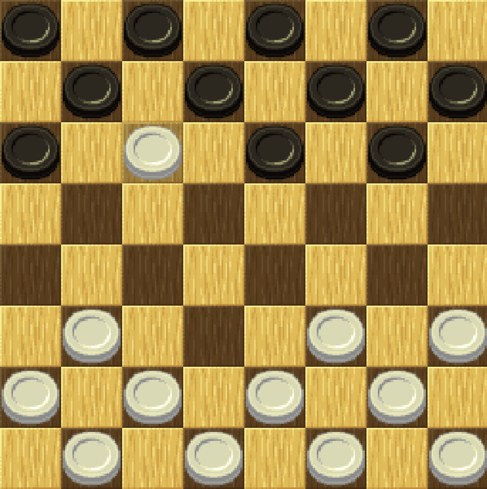

# Checkers
Following in the footsteps of my [ninjy repository](https://github.com/edwardjcho99/Ninjy), I programmed this game over the course of a week.

# Tools and Frameworks
I used Javascript and the [Phaser library](https://phaser.io/phaser3), a framework for creating 2d games. In addition, I used the [mathjs library](https://mathjs.org/).

# Gameplay
This game features all the classic rules in checkers. Diagonal movements, skips, and king pieces. If a piece has a legal capture, it must play that move--unless, of course, the player had already captured with another piece on the same turn.

# Difficulties and What I Learned
As my first tile-based game, I came across many road blocks. With regards to the organization of my custom classes, I separated them into the following: Board, Checkerpiece, CheckerTile, and Position. My plan was for each piece to provide the board with its legal moves. Once all the legal moves are taken for each piece, the turn transfers to the next player.

This created a lot of problems. For one, double--or triple or quadruple--skipping pieces was difficult. In addition, I came across a problem where each piece had to know the state of all the other pieces. This is because a piece can't move if another piece on the same team has a legal skip. I also had problems choreographing the state of the game with the actual sprites and view of the game.

In hindsight, a better solution would have been to set this game up in the Model View Controller design pattern, which I learned in class a few weeks after programming this. I could have handled all the legal moves in the model, and then transferred them to the view, which would consist of the pieces, tiles, board, and anything else visual. Then, the player could input his moves through the controller.

As it did before, [this YouTube tutorial series](https://www.youtube.com/watch?v=frRWKxB9Hm0) by Luis Zuno :pray: helped me a ton.
